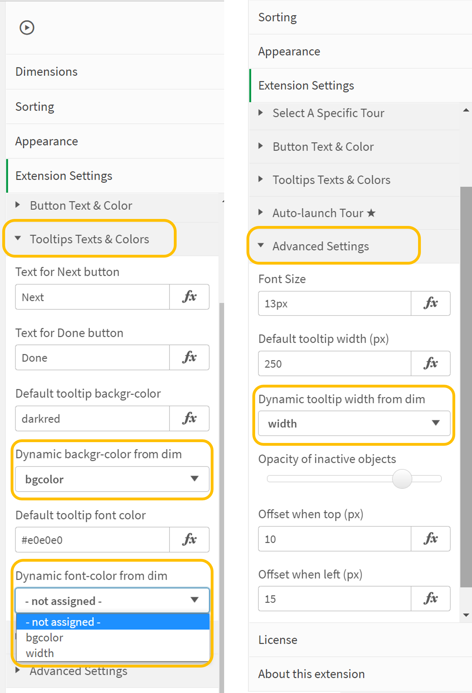

# GuidedTour Extension for Qlik Sense Client

## About
[Version History](./db_ext_guided_tour.qext)

This extension allows to make a tour of colored tooltips (text bubbles) which highlight certain objects on a worksheet. 

 

## Getting started
To render, it requires a data table loaded by data manager or load script with at least 2 colums: 

1. Qlik objectId
2. Text for tooltip (can contain html tags, good for formatting or hyperlinks)

Supported are up to 5 columns. So you can add up to 3 more columns which define per tooltip  

 * Background-color (in css format e.g.: `#0a0b1c`, `rgb(45,45,45)`, `rgba(0,0,0,0.25)`, `darkred` ...)
 * Text-color (in css format)
 * Width in pixels (250 is the default; the height will be dynamically determined)
 
You will find dropdowns in the properties of the extension to choose which dimension (3rd, 4th, 5th) will deliver which attribute. 
If the data table doesn't have a value (length zero or null) then the default setting for bg-color, text-color, and width kicks in.

If you don't want different attributes per tooltip, but all to look the same, just use the default settings.

  

The extension also allows to configure the texts for "Start Tour", "Next" and "Done" links.

## Mode of Guided Tour

There are 4 modes of operation (some are premium feature and need a license)
 * Click to start (standard)
 * Mouse-over mode (premium) 
 * Auto-launch always (standard)
 * Auto-launch once (premium)

The **Auto-launch once** will open a tour (in Analysis mode) once per user (actually, per browser, because it remembers that the tour started in the local
browser storage). The extension compares the last tour visit of the user with a cutoff date set by the application. If that date at a later point of time
is newer than the last visit, the tour will restart again. That way you can present "What's new" easily.

The **Mouse-over mode** adds a switch icon into the tour button, when it is turned on, the respective tooltip shows when the user moves the mouse over the object
that the tooltip belongs to. The mouseover events can be disabled (unregistered) by turning the same switch off again. 

## Click on the Sense objects to create a tour

New as of 10-Nov-2021 is the button "Select Objects for tour" in the Extension Settings (accordeon menu on the right). When you click this, every object
will get a "PICK" button and the Tour Extension gets a "DONE" button. Click on the PICK buttons in the sequence you want to write help text for them, finally
click on DONE and copy/paste the IDs to your source table of the tooltip help.

## CSS Selectors to position the tooltip

In addition to the Qlik Sense object ids, you can also use **any css selector** (#id, .class, tag-selectors, ...) to point to an element in the DOM of the Sense 
Client page. You may want to use the browser's development tools (F12) for that and you should have experience with css selectors.

## Select a specific tour if you have multiple

You can use the Guided-Tour-Extension multiple times in your app, but you can use the same help-table loaded as a data table. You then need to introduce a "tour 
identifier" field (or similar name) to group those tooltips that belong together, eg `Tour_Id` Tour1, Tour2, Tour3 ...

This extension has no expression (measure) to add, so you don't need to work with set-modifers or so. The tour extension will, when the user clicks Start, 
**select** a configurable value (say "Tour1") in a configurable field (say "Tour_Id"). That way, the correct tour will start. 

Configure the field-name and the select-value in the Extension properties.

## Support of Multi-language

Like any other object, the dimension could be dynamically be calculated. That allows for example the text of the tooltip in different languages, based on a formula with a 
variable. E.g. the 2nd dimension is `=tooltip.$(vLanguage)` and the variable `vLanguage` has values like "en" or "fr", it picks a different fields `tooltip.en` or `tooltip.fr`

## Licensed Version

The licensed version gives you support and removes the ad ("sponsored by data/\bridge") at the end of a tour. Furthermore, the following features are
for the licensed product only:

 * switch sheets during tour (tour across whole app)
 * auto-launch a tour and
 * remember if a user has launched a tour already (client-side, local browser storage)

Read more [here](licensing.md)

## Known limitations

 * In small-device mode of the Sense Client, the tooltips do not render nicely.
 * Currently Internet Explorer is not supported
