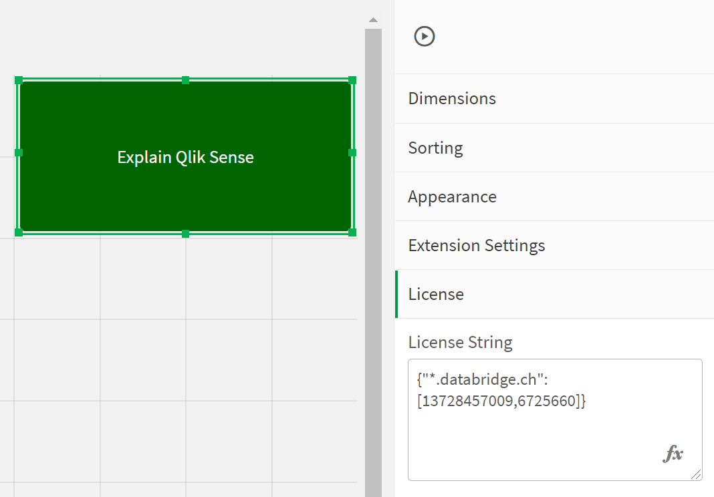
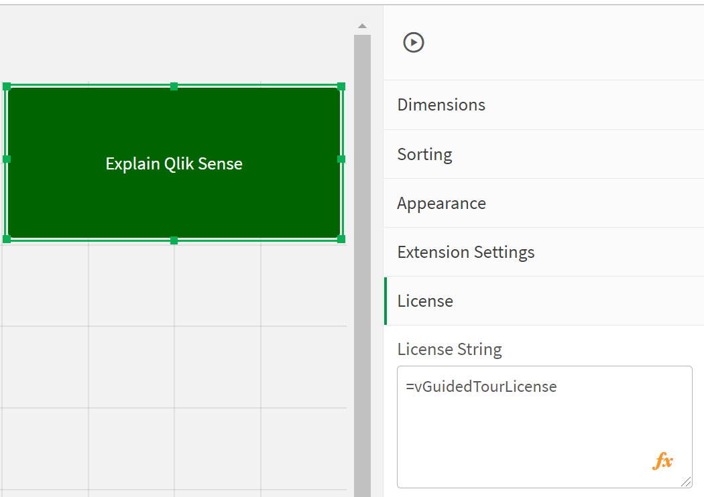

# How to license the extension

go to [Main](../README.md)

To get a license, please send an email to insight-sales@databridge.ch. The price is 199 USD per year. You can cancel after year one and continue to use the 
license-free features.

We license the server url (one * wildcard allowed), so that a license is valid for **one environment** and indepenent from #users and #apps which use it.
If you have multiple nodes or DNS synonyms for the same environment, we can combine multiple host names into one license.
With your transaction, you will get a license string (in Json format) from databridge like the below examples:

 * `{"*.prod.databridge.ch":[5262148576,6120],"*.dev.databridge.ch":[5262148576,6120]}` 
 * `{"databridge-internal.eu.qlikcloud.com":[4563262434,3142]}`

which needs to be put into the extension itself:
<p align="center">

</p>

If you will use the Guided Tour extension **multiple times**, put the license itself into a variable and refer to it from within the extension settings
```
SET vGuidedTourLicense = {"*.databridge.ch":[13728457009,6725660]};
```
<p align="center">

</p>

PS the license is checked offline within the extension itself, no need to even have internet connection from the client.
