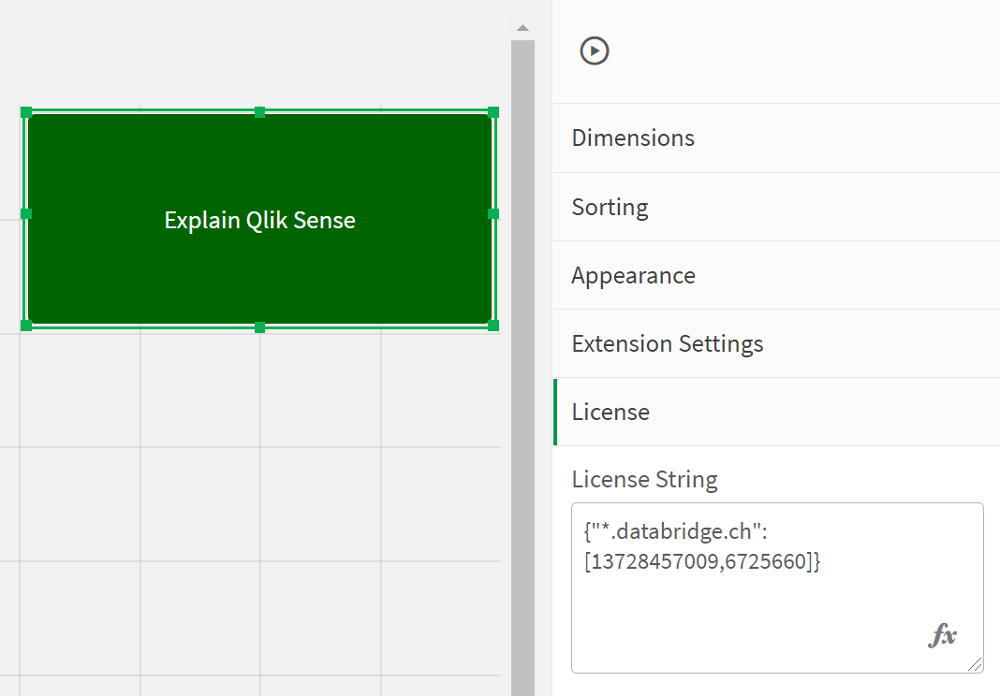

# How to license the extension

We license the server url (one * wildcard allowed), so that a license is valid for **one environment** and indepenent from #users and #apps which use it.
If you have multiple nodes or DNS synonyms for the same environment, we can combine multiple host names into one license.
With your transaction, you will get a license string (in Json format) from databridge like the below examples:

 * `{"*.prod.databridge.ch":[5262148576,6120],"*.dev.databridge.ch":[5262148576,6120]}` 
 * `{"databridge-internal.eu.qlikcloud.com":[4563262434,3142]}`

which needs to be put into the extension itself:
<p align="center">

</p>

If you will use multiple times the Guided Tour extension, put the license itself into a variable and refer to it from within the extension settings
```
SET vGuidedTourLicense = {"*.databridge.ch":[13728457009,6725660]};
```
<p align="center">

</p>

